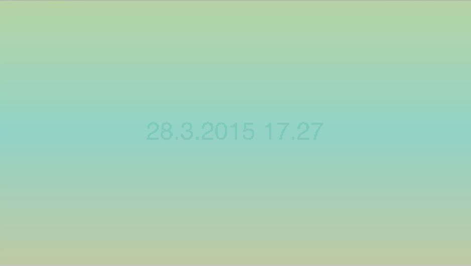

# Them Gradients
A Quartz Composer patch showing time on top of slowly oscillating gradient.
Suitable for OS X's screen saver.


To make it available for your screen saver, run the following command in your terminal (after which you can select it as your screen saver):
```curl -o /Users/$(whoami)/Library/Screen\ Savers/themgradients.qtz https://github.com/rikemonni/themgradients/blob/master/themgradients.qtz\?raw\=true```

